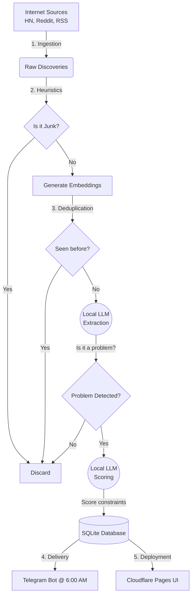

<div align="center">
  <h1>SCOUT</h1>
  <p><i>Autonomous Research Agent for Solo Developers</i></p>
</div>

---

## 📌 What is SCOUT?

SCOUT is a lightweight, fully local, and Mac-native autonomous research agent. It runs completely unattended on your machine to ingest thousands of posts across the internet, semantically analyze them using local AI, and filter out the noise to find high-value software startup opportunities (genuine problems and pain points).

### The Real Use Case
As a solo developer, finding a validated problem to solve is hard. Manually reading through HackerNews, Reddit, or RSS feeds for startup ideas is extremely tedious. 

SCOUT automates this entirely. **You sleep, SCOUT works.** 
Every night, it physically wakes your Mac, scrapes the internet, uses LLMs to score problems against your personal constraints (zero budget, solo buildable), auto-deploys a fresh dashboard to Cloudflare, and sends you a Telegram message with the best idea of the day before you even wake up.

## ⚙️ How it Works (The Funnel)

Running massive LLMs on thousands of random internet posts is too slow and heavy for a laptop. SCOUT solves this using a strict "Funnel Architecture"—starting with cheap filtering operations and only sending the surviving high-quality data to the expensive LLM.



## 🏗️ Architecture & Tools

SCOUT is fiercely decoupled to guarantee stability. Delivery and web hosting do not depend on the processing pipeline finishing successfully. Everything is stored locally on bare-metal.

- **Orchestration**: `macOS pmset` physically wakes the Mac at 1:59 AM. Apple's native `launchd` and `caffeinate` utilities lock the Mac awake in "Dark Wake" mode while Python 3.12 (`uv`) executes the pipeline.
- **The Brain (AI)**: Served entirely locally via `Ollama`. Uses a 14B model (like Qwen 2.5) for heavy lifting and `nomic-embed-text` for vector deduplication. Everything is forced into strict JSON using `Pydantic`.
- **Ingestion**: `httpx` and `feedparser` for async scraping. `tenacity` handles network retries automatically if an API rate-limits the agent.
- **Storage**: A single `SQLite` database (WAL mode enabled) handles everything. The `sqlite-vec` extension natively stores and compares vector embeddings without needing a heavy, separate vector database.
- **Dashboard**: A custom Python builder generates a beautiful, Japanese grid-style HTML dashboard and automatically executes a `git push` to trigger a `Cloudflare Pages` deployment.
- **Delivery**: A lightweight `Telegram Bot API` script runs independently to ping your phone with the top ideas.

## 🚀 Running SCOUT Locally

SCOUT is optimized for macOS Apple Silicon and uses `uv` for lightning-fast dependency management.

```bash
# Clone the repo
git clone https://github.com/VarunSaiCSE/Opportunity_SCOUT.git
cd Opportunity_SCOUT

# Setup environment
uv venv
source .venv/bin/activate
uv pip install -r requirements.txt

# Run the automated pipeline manually
uv run python -m scout.processor

# Generate the static UI manually
uv run python scripts/build_static.py
```
